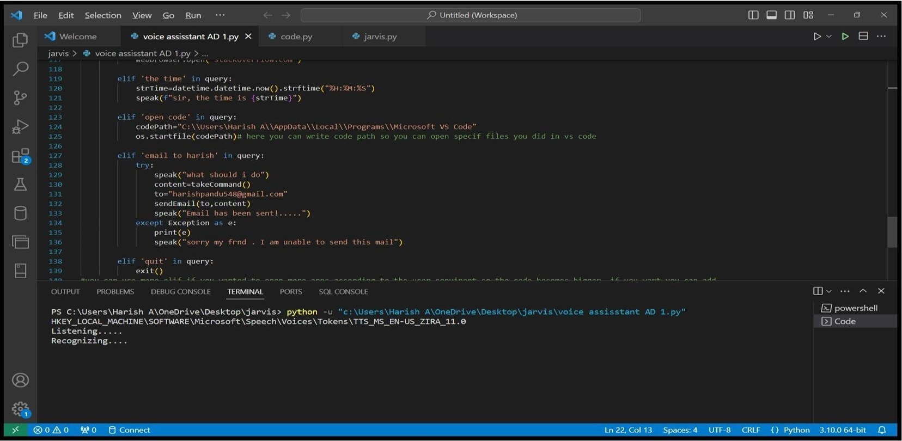
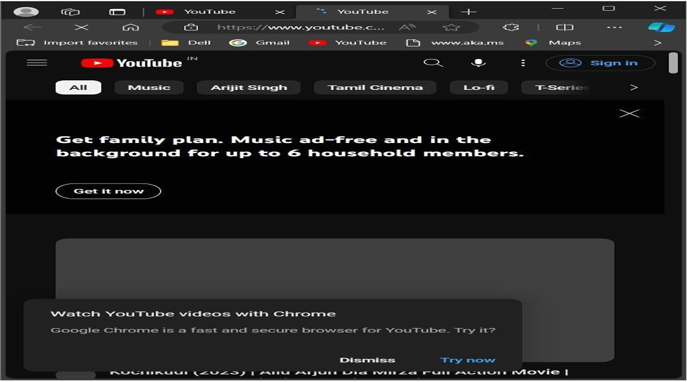

<!-- PROJECT TITLE -->
<div>
  <h1 style="bold">
    VOICE ASSISTANT USING PYTHON
  </h1>

  <h3>
    An Intelligent Voice-Controlled Assistant
  </h3>
  <hr>
</div>

<h2>Overview</h2>
In an era where technology seamlessly integrates into daily life, voice assistants have become indispensable. This Voice Assistant project harnesses the power of Python, speech recognition, and natural language processing to deliver a smart assistant capable of performing various tasks through voice commands.

<h2>What Our Project Does</h2>

This Voice Assistant simplifies interaction with devices by:
- Responding to voice commands.
- Retrieving information from the internet.
- Opening frequently used applications.
- Sending emails and assisting with daily tasks.
- Providing a seamless user experience for multitasking.

<h2>Introduction</h2>
The project showcases the application of Artificial Intelligence and Python to develop a personal assistant that listens to user commands, interprets them, and executes corresponding tasks. It combines speech recognition, natural language understanding, and task automation to streamline everyday operations.

<h2>Problem Definition</h2>
Traditional device interaction often involves manual effort, which can be time-consuming and inaccessible for certain users. Key challenges include:
- Difficulty in multitasking while operating devices.
- Limited accessibility for individuals with physical impairments.
- Inefficiency in performing routine digital tasks.

This Voice Assistant overcomes these hurdles by:
1. Enabling voice-based control for hands-free interaction.
2. Offering faster access to applications and services.
3. Enhancing accessibility and user convenience.

<h2>Key Features</h2>

1. **Voice Command Recognition**: Understands and processes voice commands.
2. **Task Execution**: Opens applications, retrieves information, and automates tasks.
3. **Email Sending**: Sends emails via voice command with SMTP integration.
4. **Customizable Commands**: Easily extendable to support additional functions.

<h2>Technologies Used</h2>

<div class="flex">
  
  
  
</div>

<h2>How to Setup</h2>

1. Clone the repository:
   ```bash
   git clone <https://github.com/your-username/Voice-Assistant.git>
   ```
2. Install dependencies:
   ```bash
   pip install pyttsx3 SpeechRecognition wikipedia smtplib
   ```
3. Run the script:
   ```bash
   python voice_assistant.py
   ```

<h2>Code Explanation</h2>

The Python script integrates key modules:
- **pyttsx3**: Converts text to speech.
- **SpeechRecognition**: Processes audio input to recognize commands.
- **wikipedia**: Retrieves information from Wikipedia.
- **smtplib**: Sends emails through SMTP.

<h2>How It Works</h2>

1. **Initialization**: The assistant initializes with a greeting based on the current time.
2. **Command Recognition**: Listens for user input and recognizes voice commands.
3. **Task Execution**: Executes tasks such as opening applications, fetching Wikipedia summaries, or sending emails.

<h2>Example Commands</h2>

- "Open YouTube"
- "Tell me about Python on Wikipedia"
- "What is the time?"
- "Send an email to [name]"

<h2>Project Screenshots</h2>

**Command Recognition:**




**Task Execution:**




<h2>Future Enhancements</h2>

1. Adding support for multiple languages.
2. Incorporating advanced AI for natural language understanding.
3. Expanding integration with third-party applications.

<h2>About Us</h2>

### Team Members
1. Saritha Veggalam
2. Harish
3. Karthik

We are passionate about leveraging technology to simplify everyday tasks and enhance accessibility for all users.
